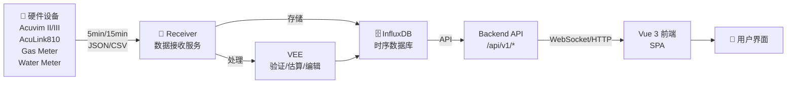
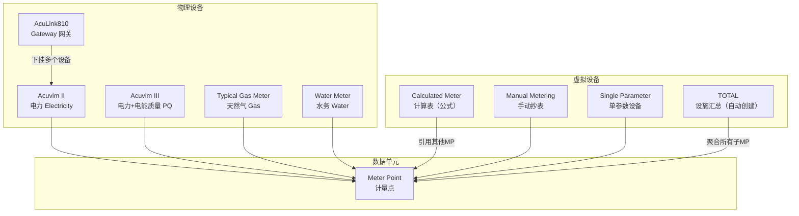
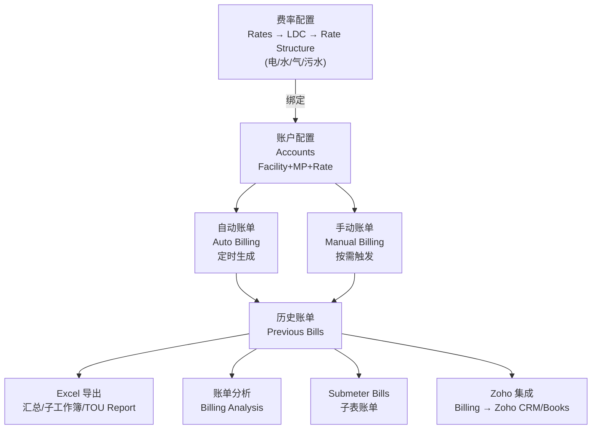
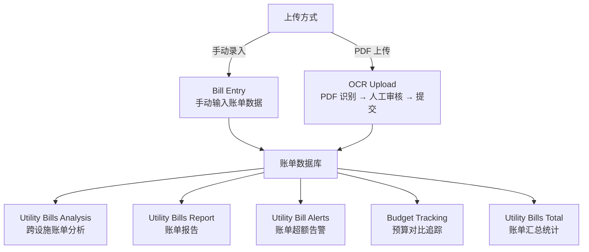
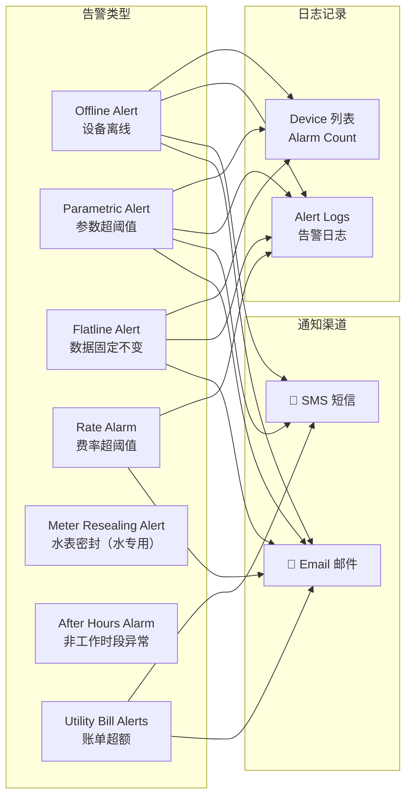
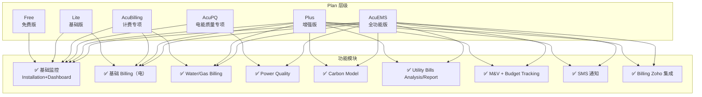

# AcuCloud 知识库全局流程图

## 系统模块总览

```mermaid
graph TB
    %% 顶层入口
    Login["🔐 Login<br>renjie.jiao@accuenergy.com"]
    
    Login --> OrgView["Organization View<br>(当前组织: AG PROYECTOS)"]
    Login --> FacView["Facility View<br>(单设施视图)"]

    %% 主模块
    OrgView --> INST["📦 Installation<br>#/installation"]
    OrgView --> DASH["📊 Dashboard<br>#/dashboard"]
    OrgView --> ANAL["📈 Analysis<br>#/analysis"]
    OrgView --> BILL["💰 Billing<br>#/billing"]
    OrgView --> UTIL["🧾 Utility Bills<br>#/utilityBills"]
    OrgView --> RPT["📄 Report<br>#/report"]
    OrgView --> DATA["💾 Data<br>#/data"]
    OrgView --> LOGS["📝 Logs<br>#/logs"]
    OrgView --> ADMIN["⚙️ Admin<br>#/admin"]
    OrgView --> SA["🔑 Super Admin<br>#/superAdmin"]
    OrgView --> PQ["⚡ Power Quality<br>#/powerQuality"]
    OrgView --> CM["🌿 Carbon Model<br>#/carbonModel"]

    %% Installation 子模块
    INST --> FAC["Facilities<br>设施管理"]
    INST --> DEV["Devices<br>设备管理"]
    INST --> MP["Meter Points<br>计量点"]
    INST --> ALT["Alerts配置<br>告警规则"]
    INST --> PORT["Portfolio<br>项目集"]

    %% Devices 子类型
    DEV --> PHY["Physical<br>物理电表/网关"]
    DEV --> CALC["Calculated<br>计算表"]
    DEV --> MANUAL["Manual Metering<br>手动抄表"]
    DEV --> SINGLE["Single Parameter<br>单参数设备"]

    %% Analysis 子模块
    ANAL --> ENERGY["Energy<br>能耗趋势"]
    ANAL --> ACCUM["Accumulative<br>累计分析"]
    ANAL --> RT["Realtime<br>实时+预测基线"]
    ANAL --> HEAT["Heatmap<br>热力图"]
    ANAL --> SCHED["Schedule<br>排程分析"]
    ANAL --> ANN["Annotations<br>标注"]
    ANAL --> MV["M&V<br>测量与验证"]

    %% Billing 子模块
    BILL --> RATES["Rates<br>费率配置"]
    BILL --> ACCT["Accounts<br>账户配置"]
    BILL --> AUTO["Auto Billing<br>自动计费"]
    BILL --> MANU["Manual Billing<br>手动计费"]
    BILL --> PREV["Previous Bills<br>历史账单"]
    BILL --> BA["Billing Analysis<br>账单分析"]

    %% Data 子模块
    DATA --> DEXP["Data Exports<br>数据导出"]
    DATA --> DFWD["Data Forwards<br>数据转发"]
    DATA --> DIMP["Data Import<br>数据导入"]
    DATA --> DEDIT["Data Edit<br>数据编辑"]
    DATA --> VEE["Manual VEE<br>验证/估算/编辑"]
    DATA --> MMEXP["Max Min Export<br>最值导出"]
```



---

## 数据采集链路



---

## 设备类型与数据流



---

## Billing 计费流程



---

## Utility Bills（公共事业账单）流程



---

## 告警体系



---

## 订阅 Plan 与功能权限



---

## 知识库文件索引

```
acucloud_knowledge/
├── 01_overview.md          → 平台概述、技术架构、测试环境
├── 02_navigation.md        → 导航结构、路由规则
├── 03_home.md              → 首页
├── 04_installation.md      → 设施/设备/计量点管理（完整版）
├── 05_billing.md           → 计费模块（Rates/Accounts/Auto/Manual/Utility Bills）
├── 06_utility_bills.md     → 公共事业账单（原版）
├── 07_analysis.md          → 能耗分析（Energy/Realtime/M&V/Schedule/Heatmap）
├── 08_power_quality.md     → 电能质量分析 + PQ Meter Point Tier
├── 09_carbon_model.md      → 碳排放模型 + Plan 要求
├── 10_report.md            → 报告管理（能耗/计费/Utility Bills/TOU）
├── 11_data.md              → 数据管理（导出/导入/编辑/VEE/转发）
├── 12_admin.md             → 组织管理员（用户/订阅/自定义）
├── 13_super_admin.md       → 超级管理员（全局管理/Plan/Device Model）
├── 14_api.md               → API 接口规范
├── 15_gas_model.md         → 天然气模型（数据格式/单位转换/分析）
├── 16_dashboard.md         → 仪表盘（Widget/kVA/Sankey/Auto Refresh）
├── 17_alerts.md            → 告警体系（类型/通知/日志）
├── 18_subscription_plan.md → 订阅 Plan 详细对照（功能矩阵/Tier）
└── FLOWCHART.md            → 本文件（系统流程图）
```
